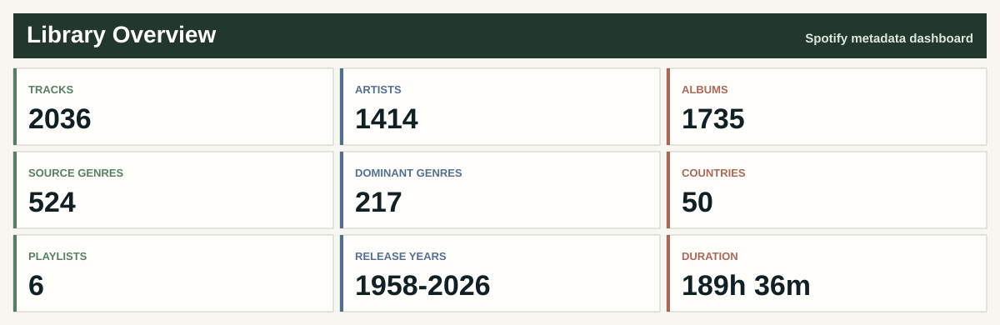
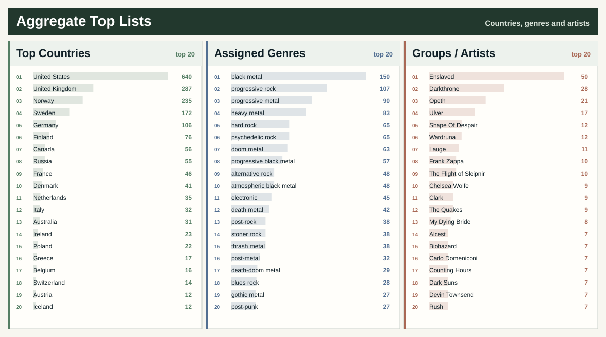
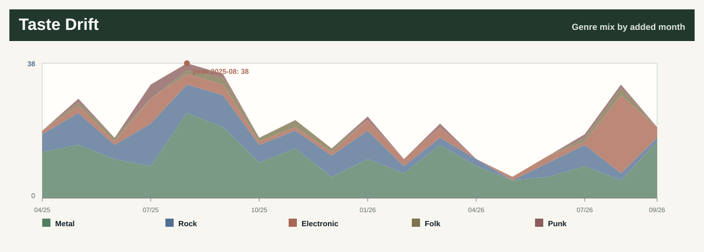
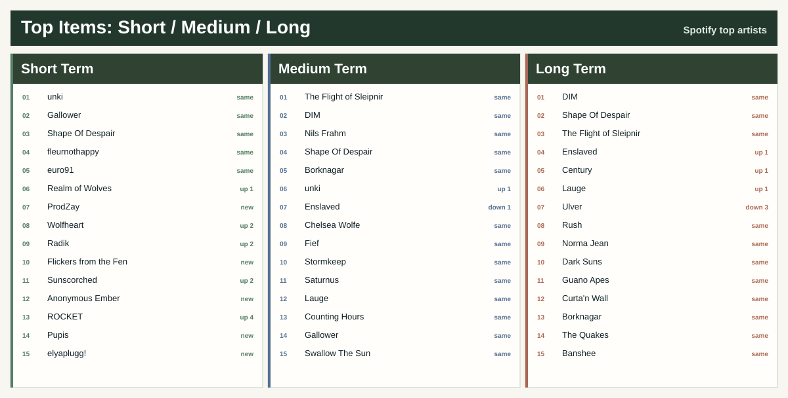
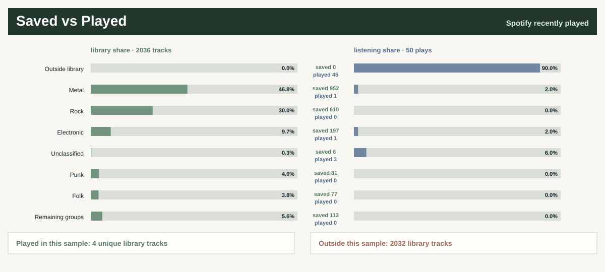
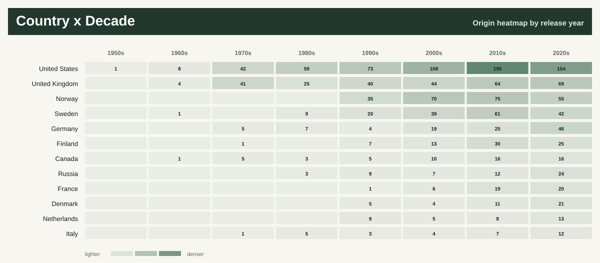
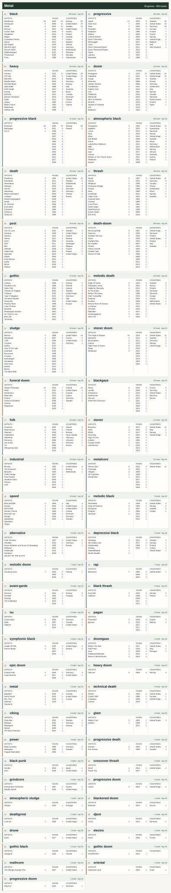
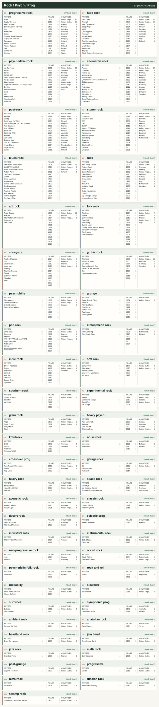
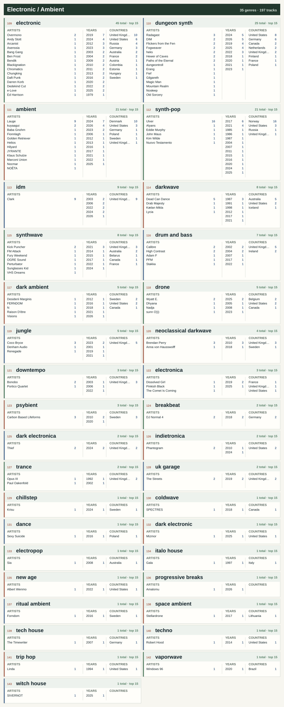
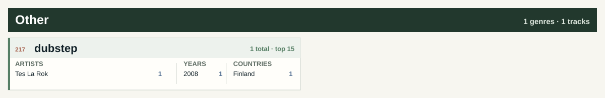

# Spotify README Dashboard · Template

Create your own Spotify music dashboard in a GitHub README. A Python template with automatic updates, genre maps, favorite albums and private source data.

**[Create your own dashboard](https://github.com/maxkrut/spotify-readme-dashboard/generate)** · [`Setup guide`](SETUP.md) · [Live dashboard](#live-dashboard) · [`MIT License`](LICENSE)

For developers who love music: publish your library, explore artist genres and countries, and follow changes in your taste. Python generates the charts; GitHub Actions refreshes them weekly. No separate web server is needed.

## Quick start

1. Choose **Use this template → Create a new repository** and clone your copy.
2. Create your own Spotify app and run the local export once.
3. Store the exported CSV in a separate **private** GitHub repository.
4. Add your Spotify and private repository credentials as GitHub Actions secrets.
5. Run **Actions → Update public README → Run workflow** to publish your dashboard.

Follow the [`step-by-step setup guide`](SETUP.md) for prerequisites, commands and the exact secrets to add. You can also preview the included example without Spotify credentials.

## Live dashboard

The dashboard below shows this repository owner's library. In a new copy, the first successful update replaces the inherited example with your own music.

_Last updated 2026-10-05 12:20 UTC._

No audio files are included: this repository publishes generated summaries from a private CSV archive.

## Favorite Albums

Albums ranked by the number of distinct liked tracks. At least five liked tracks from an album are required.

## This Week in the Library

Changes between observations on 2026-09-28 and 2026-10-05. These are library changes, not listening counts.

**1** new tracks · **1** new liked tracks · **1** new artists · **1** new albums · **0** new countries

Removed from the library: **0** tracks.

Genre share changes: Metal: +0.8 pp; Rock / Psych / Prog: -0.7 pp; Electronic / Ambient: -0.3 pp. Metadata corrections can also change these shares.

## Latest Liked Tracks

The ten most recent known like dates. Legacy tracks with mixed playlist/like dates are excluded until the next Spotify export.

<table width="100%" cellpadding="8" cellspacing="0">
<tbody>
<tr>
<td align="left" valign="top"><strong><a href="https://open.spotify.com/track/6b7ThqpVKB2xSy5ECQYmt8">Umbral Nocturne Part I</a></strong> — Nordicwinter <small>A Hopeless Dawn · 2026 · depressive black metal · Liked 2026-10-02</small></td>
</tr>
<tr>
<td align="left" valign="top"><strong><a href="https://open.spotify.com/track/2vRVYF2ddWmw57fKcRjlCm">Nothingness by my Side</a></strong> — Grey Shores <small>Dark Waters of Night · 2026 · Liked 2026-09-28</small></td>
</tr>
<tr>
<td align="left" valign="top"><strong><a href="https://open.spotify.com/track/3ELHiGWV6hte7m19eJs8WZ">I Want to Die Before You</a></strong> — Genital Shame <small>I Want to Die Before You · 2026 · black metal · Liked 2026-09-28</small></td>
</tr>
<tr>
<td align="left" valign="top"><strong><a href="https://open.spotify.com/track/0MhNj8gHOpSvNCP3Zr1GAo">Evolution</a></strong> — OSC <small>Bay Area Dubstep, Vol. 2 · 2010 · Liked 2026-09-26</small></td>
</tr>
<tr>
<td align="left" valign="top"><strong><a href="https://open.spotify.com/track/1RSFYPyVbfOOsilG55FnFL">Living Fire</a></strong> — Tes La Rok <small>Up in the VIP · 2008 · dubstep · Liked 2026-09-26</small></td>
</tr>
<tr>
<td align="left" valign="top"><strong><a href="https://open.spotify.com/track/5M6K421zAbrXbdbFfJNnaw">The Nine</a></strong> — Volkra <small>Sárspell · 2026 · Liked 2026-09-25</small></td>
</tr>
<tr>
<td align="left" valign="top"><strong><a href="https://open.spotify.com/track/1jaQ4NcOUUMoigYyMmLLtv">solus barque</a></strong> — Hilyard; Lauge <small>a handful of ashes · 2026 · ambient · Liked 2026-09-25</small></td>
</tr>
<tr>
<td align="left" valign="top"><strong><a href="https://open.spotify.com/track/7fIKufBCo0xLbza9GbvSGB">Trouble Every Day - 1966 Mono Mix</a></strong> — The Mothers Of Invention; Frank Zappa <small>Freak Out! (60th Anniversary) · 2026 · art rock · Liked 2026-09-25</small></td>
</tr>
<tr>
<td align="left" valign="top"><strong><a href="https://open.spotify.com/track/6RrUexWtOLbuU8K3YxF7oh">Abode of the Perfect Soul</a></strong> — Dvne <small>Voidkind · 2024 · progressive metal · Liked 2026-09-18</small></td>
</tr>
<tr>
<td align="left" valign="top"><strong><a href="https://open.spotify.com/track/2nhQeK6SU0RQaWiNSgOWCG">Sunflower</a></strong> — Show Me A Dinosaur <small>Plantgazer · 2020 · blackgaze · Liked 2026-09-18</small></td>
</tr>
</tbody>
</table>

## Library Rankings

## Listening Trends

How the library changes over time, from recent taste shifts to long-term listening patterns.

### Taste Drift

Monthly changes across the dominant genre groups in recently saved music.

### Short, Medium and Long Term

Rank changes compare each Spotify time range with the same range in the previous fetched snapshot. No movement badges appear before a baseline exists.

### Saved vs Played

Genre proportions in the library and in the available listening sample. Each side totals 100%; repeated plays count separately. A missing listening sample is shown as unavailable.

### Countries by Decade

Artist origins across release decades, using MusicBrainz, Wikidata and curated overrides.

## Genre Atlas

Each lead artist appears under one dominant genre: the most frequent primary genre among their recordings in this library. Source-linked artist profiles resolve ties and documented career-wide exceptions. Track totals follow the lead artist's category; release-specific genres remain in the underlying data.

6 tracks have no usable genre and are excluded from the atlas. They remain in library totals as Unclassified.

<strong>Metal</strong> · 55 genres · 953 track assignments

<strong>Rock / Psych / Prog</strong> · 53 genres · 610 track assignments

<strong>Electronic / Ambient</strong> · 35 genres · 197 track assignments

<strong>Punk / Hardcore</strong> · 14 genres · 81 track assignments

<strong>Folk / World</strong> · 15 genres · 77 track assignments

<strong>Jazz / Blues</strong> · 11 genres · 25 track assignments

<strong>Soul / Funk / R&amp;B</strong> · 7 genres · 15 track assignments

<strong>Reggae / Ska</strong> · 1 genre · 2 track assignments

<strong>Afrobeat / Latin</strong> · 2 genres · 2 track assignments

<strong>Classical / Score</strong> · 8 genres · 27 track assignments

<strong>Pop / Songwriter</strong> · 7 genres · 25 track assignments

<strong>Hip-Hop / Rap</strong> · 4 genres · 11 track assignments

<strong>Experimental / Noise</strong> · 4 genres · 5 track assignments

<strong>Other</strong> · 1 genre · 1 track assignment

## Data Quality & Freshness

| Source / coverage | Status |
| --- | --- |
| Library export | 2026-10-05 12:20 UTC · current |
| Spotify top artists | 2026-10-05 12:20 UTC · current |
| Recently played snapshot | 2026-10-05 12:20 UTC · current |
| Listening sample | 2026-10-02 17:38 – 2026-10-05 07:09 UTC; 50 plays |
| Tracks with a usable genre | 2,031 / 2,037 (99.7%) |
| Tracks awaiting genre confirmation | 3 |
| Tracks with a known artist country | 1,969 / 2,037 (96.7%) |

Coverage measures completeness, not verification of every genre or country. Build time above is separate from source freshness.

## Recommended Music Resources

A few music services I use and recommend:

- [Every Noise at Once](https://everynoise.com/) — explore genres and their connections.
- [Rate Your Music](https://rateyourmusic.com/) — ratings, lists and music discovery.
- [Discogs](https://www.discogs.com/) — detailed release credits and editions.
- [Bandcamp](https://bandcamp.com/) — discover and support independent artists.
- [WhoSampled](https://www.whosampled.com/) — samples, covers and remixes.
- [Songfacts](https://www.songfacts.com/) — stories and facts behind songs.
- [Equipboard](https://equipboard.com/) — gear used by musicians.
- [Encyclopaedia Metallum](https://www.metal-archives.com/) — metal bands and releases.

How it works

- `python scripts/export_spotify.py` updates `data/tracks.csv` from saved tracks and owned/collaborative playlists, plus Spotify top and recent snapshots.
- `python scripts/backfill_countries_musicbrainz.py --fetch-missing-artists` backfills artist countries from MusicBrainz and Wikidata.
- `python scripts/enrich_genres_musicbrainz.py` fills blank genres from cached MusicBrainz artist tags.
- `python scripts/apply_genre_rules.py --overwrite` applies curated genre rules.
- `python scripts/audit_genres.py` checks every artist and records a private review report.
- `python scripts/build_readme.py` regenerates the dashboard and SVG assets.
- Manual fields are preserved during export: `year`, `primary_genre`, `genres`, `genre_status`, `rating`, `status`, `tags`, `notes`.
- Weekly GitHub Actions use a private data repository; the public repository contains only generated summaries and public rules.

Create a Spotify app, run the local OAuth export once, store the full `data/tracks.csv` in a private data repository, then set public repository secrets described in `DATA.md`. GitHub Actions can refresh the public dashboard weekly without publishing the full CSV. Spotify user refresh tokens expire after six months; when the workflow reports `invalid_grant`, or after adding `user-top-read` / `user-read-recently-played`, reauthorize locally and update the `SPOTIFY_REFRESH_TOKEN` secret.

Data

- Source table: private `data/tracks.csv` fetched during the weekly workflow and not published in this repository.
- First-time setup: [`SETUP.md`](SETUP.md)
- Data setup: [`DATA.md`](DATA.md)
- Track CSV example: [`data/tracks.example.csv`](data/tracks.example.csv)
- Genre rules: [`data/genre_rules.csv`](data/genre_rules.csv)
- Artist genre profiles: [`data/artist_genre_profiles.csv`](data/artist_genre_profiles.csv)
- MusicBrainz identity exclusions: [`data/musicbrainz_identity_exclusions.csv`](data/musicbrainz_identity_exclusions.csv)
- Country overrides: [`data/country_overrides.csv`](data/country_overrides.csv)
- README generator: [`scripts/build_readme.py`](scripts/build_readme.py)
- Spotify exporter: [`scripts/export_spotify.py`](scripts/export_spotify.py)
- MusicBrainz country backfill: [`scripts/backfill_countries_musicbrainz.py`](scripts/backfill_countries_musicbrainz.py)
- MusicBrainz genre enricher: [`scripts/enrich_genres_musicbrainz.py`](scripts/enrich_genres_musicbrainz.py)
- Genre rule applier: [`scripts/apply_genre_rules.py`](scripts/apply_genre_rules.py)
- Spotify API debug: [`scripts/debug_spotify.py`](scripts/debug_spotify.py)

License

- Repository code and generated dashboard assets: [`MIT License`](LICENSE).
- Spotify, MusicBrainz and Wikidata metadata, plus linked Spotify artwork, remain governed by their source terms.

Created by Maksim Krutikov.
